<div align="center">
  <h1>🏎️ TCC-System</h1>
  <p><strong>Sistema de Telemetría y Control Concurrente</strong></p>

  
  
  

  <br/><br/>
  <p><em>Backend de telemetría F1 🏁 — 100% C nativo para Windows</em></p>
</div>

---

## 📖 Descripción General

Un sistema de telemetría automotriz y control concurrente de **alto rendimiento** nativo para Win32, desarrollado puramente en **C** 🔥

<table>
<tr>
<td>⚡ Ingesta masiva de datos a alta velocidad</td>
</tr>
<tr>
<td>🔄 Comunicación eficiente entre procesos (IPC)</td>
</tr>
<tr>
<td>🔒 Sincronización segura de hilos bajo concurrencia extrema</td>
</tr>
</table>

Desarrollado exclusivamente para **Microsoft Windows** utilizando la API nativa **Win32** (`windows.h`), garantizando:

| 💚 | 🛡️ |
|---|---|
| CPU ~0% en idle (sin espera activa) | Prevención absoluta de *race conditions* y *deadlocks* |

---

## 🏗️ Arquitectura del Sistema

La arquitectura se basa en un **pipeline completamente desacoplado y orientado a eventos**, donde los componentes se comunican estrictamente a través de primitivas IPC de Windows a nivel de Kernel:



---

## 📦 Desglose Modular y Responsabilidades

<details open>
<summary><strong>🚗 Módulo 1</strong> — Subsistema de Sensores (Procesos Independientes)</summary>

- Simula la telemetría física del vehículo (Motor, Neumáticos, Frenos, GPS)
- Instancia **N** procesos independientes en paralelo
- Genera estructuras empaquetadas con **timestamps de alta resolución**
- Transmite datos por **Named Pipes** en modo bloqueante
</details>

<details open>
<summary><strong>🧠 Módulo 2</strong> — Broker Ingestor Central (Proceso Multihilo)</summary>

- Gestiona conexiones entrantes mediante `ConnectNamedPipe`
- Crea hilos receptores (`CreateThread`) para depositar en un **Buffer Circular**
- Almacena datos en **Memoria Compartida** (`CreateFileMapping`)
- Sincronización con **Semáforos** y **Mutexes** de Win32
</details>

<details open>
<summary><strong>⚙️ Módulo 3</strong> — Distribuidor y Pool de Workers (Procesamiento)</summary>

- Consume elementos del búfer compartido de forma independiente
- Analiza prioridad del paquete y lo redirige al **pool de workers**
- Procesa concurrentemente y persiste con `LockFileEx`
</details>

<details open>
<summary><strong>📊 Módulo 4</strong> — Monitor del Sistema (Observabilidad)</summary>

- Consola de administración como proceso independiente
- Mapea memoria compartida en **solo lectura** (`OpenFileMapping`)
- Estadísticas en tiempo real: ocupación del búfer, tasa de procesamiento, sensores activos
- Coordinación mediante **Eventos de Windows** (`CreateEvent`)
</details>

---

## 🛠️ Detalles de Implementación Técnica

### 🎯 Espera Activa Cero (*Zero-Busy Waiting*)

> Toda planificación y sincronización se basa en **bloqueo pasivo del kernel**.  
> Uso exclusivo de primitivas de control nativas de Windows.

### 🌊 Tolerancia al Desbordamiento Natural (*Backpressure*)

1. El pool de hilos se sobrecarga → el **Buffer Circular** se llena
2. Esto bloquea pasivamente los hilos receptores mediante **semáforos**
3. El Kernel retiene naturalmente el flujo del sensor en `WriteFile`

### 🔒 Cierre Determinista de Handles

| Recurso | Función de liberación |
|---------|----------------------|
| Handles del sistema | `CloseHandle` |
| Archivos mapeados | `UnmapViewOfFile` |
| Mapeos de memoria | Liberación completa |

✅ **Garantía absoluta:** Ausencia total de fugas de memoria en el kernel.

---

## 📁 Estructura del Repositorio

```
tcc-system/
│
├── 📂 bin/                    # ¡Obligatorio! Ejecutables .exe
├── 📂 docs/                   # Informes académicos y diagramas
├── 📂 include/                # Cabeceras compartidas globales
│   ├── 📄 common.h            # Estructuras y definiciones comunes
│   └── 📄 ipc_protocol.h      # Protocolos de comunicación IPC
├── 📂 src/                    # Código fuente por módulo
│   ├── 📂 modulo1_sensores/   # 🚗 Módulo 1
│   ├── 📂 modulo2_broker/     # 🧠 Módulo 2
│   ├── 📂 modulo3_dispatcher/ # ⚙️ Módulo 3
│   └── 📂 modulo4_monitor/    # 📊 Módulo 4
└── 📄 Makefile                # Script de compilación
```

---

## 🚀 Compilación y Ejecución

### 📋 Prerrequisitos

| Requisito | Detalle |
|-----------|---------|
| 🖥️ SO | Microsoft Windows (10/11 recomendado) |
| 🛠️ Compilador | MSVC (Visual Studio) o MinGW (GCC) |

### 🔨 Compilación del Proyecto

<details>
<summary><strong>Opción 1:</strong> Usando Makefile</summary>

```bash
# GCC/MinGW
make All
```

</details>

<details>
<summary><strong>Opción 2:</strong> Compilación directa con MSVC</summary>

```bash
cl.exe /W4 /O2 src/modulo1_sensores/sensor.c /Fe:bin/sensor.exe
cl.exe /W4 /O2 src/modulo2_broker/broker.c /Fe:bin/broker.exe
cl.exe /W4 /O2 src/modulo3_dispatcher/dispatcher.c /Fe:bin/dispatcher.exe
cl.exe /W4 /O2 src/modulo4_monitor/monitor.c /Fe:bin/monitor.exe
```

</details>

### 🎮 Ejecución — Prueba de Estrés Concurrente


```bash
:: 1. Iniciar el backend
start bin/broker.exe
start bin/dispatcher.exe

:: 2. Abrir el monitor
start bin/monitor.exe

:: 3. Lanzar 8 sensores simultáneos
FOR /L %i IN (1,1,8) DO start bin/sensor.exe
```

---

## 📊 Métricas de Rendimiento

<div align="center">

| 🏎️ Sensores | ⚡ Tasa de ingesta | 💚 CPU en idle | 🔒 Condiciones de carrera | 🧠 Memoria |
|:-----------:|:-----------------:|:--------------:|:------------------------:|:----------:|
| Hasta 10 | Tiempo real | ~0% | 0 | Sin fugas |

</div>

---

## 👥 Equipo de Desarrollo

<div align="center">

| | Módulo | Responsable |
|---|--------|:-----------:|
| 🚗 | Sensores | Responsable 1 |
| 🧠 | Broker | Responsable 2 |
| ⚙️ | Dispatcher | Responsable 3 |
| 📊 | Monitor | Responsable 4 |

</div>

---

## 📝 Licencia

> Este proyecto fue desarrollado con **fines académicos** para demostrar conceptos avanzados de programación concurrente y comunicación entre procesos en sistemas Windows.

---

<div align="center">
  <a href="#">⬆ Volver al inicio</a>
  <br/><br/>
  <strong>Hecho con ❤️ y mucho 🧵 en C para Windows</strong>
</div>
