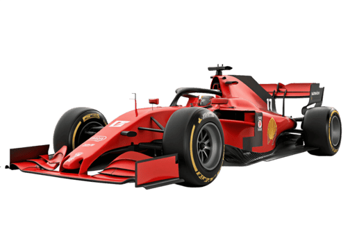

<div align="center">
  <p align="center">
    
  </p>



 Un sistema de telemetría automotriz y control concurrente de **alto rendimiento** nativo para Win32, desarrollado puramente en **C**. 🔥
 
  
  
  

  <br/><br/>
</div>

---

## 🏗️ Arquitectura del Sistema

La arquitectura se basa en un **pipeline completamente desacoplado y orientado a eventos**, donde los componentes se comunican estrictamente a través de primitivas IPC de Windows a nivel de Kernel:


---

## 📦 Desglose Modular y Responsabilidades

<details open>
<summary><strong>🚗 Módulo 1</strong> — Subsistema de Sensores (Procesos Independientes)</summary>

- Simula la telemetría física del vehículo (Motor, Neumáticos, Frenos, GPS)
- Instancia **N** procesos independientes en paralelo
- Genera estructuras empaquetadas con **timestamps de alta resolución**
- Transmite datos por **Named Pipes** en modo bloqueante
</details>

<details open>
<summary><strong>🧠 Módulo 2</strong> — Broker Ingestor Central (Proceso Multihilo)</summary>

- Gestiona conexiones entrantes mediante `ConnectNamedPipe`
- Crea hilos receptores (`CreateThread`) para depositar en un **Buffer Circular**
- Almacena datos en **Memoria Compartida** (`CreateFileMapping`)
- Sincronización con **Semáforos** y **Mutexes** de Win32
</details>

<details open>
<summary><strong>⚙️ Módulo 3</strong> — Distribuidor y Pool de Workers (Procesamiento)</summary>

- Consume elementos del búfer compartido de forma independiente
- Analiza prioridad del paquete y lo redirige al **pool de workers**
- Procesa concurrentemente y persiste con `LockFileEx`
</details>

<details open>
<summary><strong>📊 Módulo 4</strong> — Monitor del Sistema (Observabilidad)</summary>

- Consola de administración como proceso independiente
- Mapea memoria compartida en **solo lectura** (`OpenFileMapping`)
- Estadísticas en tiempo real: ocupación del búfer, tasa de procesamiento, sensores activos
- Coordinación mediante **Eventos de Windows** (`CreateEvent`)
</details>

---

## 🛠️ Detalles de Implementación Técnica

### 🎯 Espera Activa Cero (*Zero-Busy Waiting*)

> Toda planificación y sincronización se basa en **bloqueo pasivo del kernel**.  
> Uso exclusivo de primitivas de control nativas de Windows.

### 🌊 Tolerancia al Desbordamiento Natural (*Backpressure*)

1. El pool de hilos se sobrecarga → el **Buffer Circular** se llena
2. Esto bloquea pasivamente los hilos receptores mediante **semáforos**
3. El Kernel retiene naturalmente el flujo del sensor en `WriteFile`

### 🔒 Cierre Determinista de Handles

| Recurso | Función de liberación |
|---------|----------------------|
| Handles del sistema | `CloseHandle` |
| Archivos mapeados | `UnmapViewOfFile` |
| Mapeos de memoria | Liberación completa |

✅ **Garantía absoluta:** Ausencia total de fugas de memoria en el kernel.

---

## 📁 Estructura del Repositorio

```
TCC-System/
│
├── 📂 bin/                    # Ejecutables .exe
├── 📂 docs/                   # Documentación y diagramas
├── 📂 include/                # Cabeceras compartidas globales
│   │
│   ├── 📄 common.h            # Estructuras y definiciones comunes
│   └── 📄 ipc_protocol.h      # Protocolos de comunicación IPC
│   
├── 📂 src/                   # Código fuente
│   │
│   ├── 📂 sensors/           # 🚗 Módulo 1
│   ├── 📂 broker/            # 🧠 Módulo 2
│   ├── 📂 dispatcher/        # ⚙️ Módulo 3
│   └── 📂 monitor/           # 📊 Módulo 4
│   
└── 📄 Makefile                # Script de compilación
```

---

## 🚀 Compilación y Ejecución

### 📋 Prerrequisitos

| Requisito | Detalle |
|-----------|---------|
| 🖥️ SO | Microsoft Windows (10/11 recomendado) |
| 🛠️ Compilador | MSVC (Visual Studio) o MinGW (GCC) |

### 🔨 Compilación del Proyecto

<details>
<summary><strong>Opción 1:</strong> Usando Makefile</summary>

```bash
# GCC/MinGW
make All
```

</details>

<details>
<summary><strong>Opción 2:</strong> Compilación directa con MSVC</summary>

```bash
cl.exe /W4 /O2 src/sensores/sensor.c /Fe:bin/sensor.exe
cl.exe /W4 /O2 src/broker/broker.c /Fe:bin/broker.exe
cl.exe /W4 /O2 src/dispatcher/dispatcher.c /Fe:bin/dispatcher.exe
cl.exe /W4 /O2 src/monitor/monitor.c /Fe:bin/monitor.exe
```
</details>

</div>

## 👥 Equipo de Desarrollo

<div align="center">

| | Módulo | Responsable |
|---|--------|:-----------:|
| 🚗 | Sensores | Samuel Prado |
| 🧠 | Broker | Rolannys Sanchez |
| ⚙️ | Dispatcher | Kelvys Concepcion |
| 📊 | Monitor | Miguel Mora |

</div>
